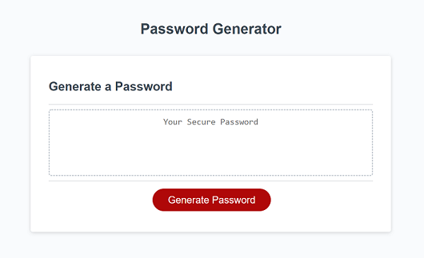
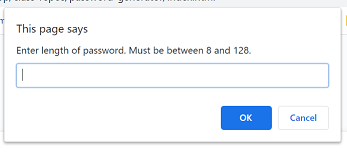

# password-generator

## Description

In this project, I created a password generator. Once a user enters a password length and  
selects from several character types, a random password is generated. The functionality is as follows:

* The user will click a button on a web page to generate a password.
* The user will be prompted to enter a password length between 8 and 128.
* The user will be asked to confirm whether they want to include upper case letters.
* The user will be asked to confirm whether they want to include lower case letters.
* The user will be asked to confirm whether they want to include numbers.
* The user will be asked to confirm whether they want to include special characters.
* An alert will display if a number between 8 and 128 was not entered for the password lenght.
* An alert will display if none of the character types was selected.
* If there are no errors from user input, a password will be generated and displayed on the screen.

## Installation

This project requires the following files and folders:

* index.html
* script.js
* assets folder
* assets/style.css

## Deployed Website

[Password Generator Website](https://johannaleal.github.io/password-generator/)

## Index.html Screenshot

## Enter Password Length Prompt

## Password Length Error Alert

## Upper Case Character Confirm

## Password Generated Web Page

